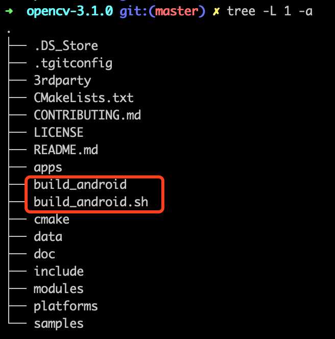
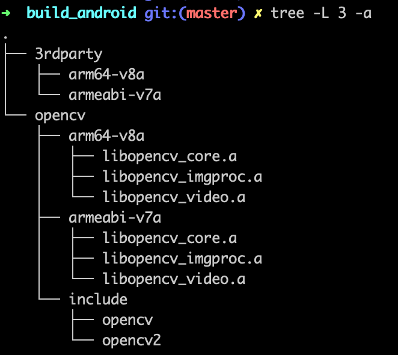

# OpenCV_Build4Android
Build OpenCV for Android with cross compile chain

当前项目目录下的 build_android.sh 是对 OpenCV 的裁剪编译，只编译了 libopencv_core 、libopencv_imgproc、libopencv_video 三个模块，如果需要自定制，可以修改 build_android.sh 里的 build_opencv_modules 函数，打开你需要的模块。模块所需要依赖的其他模块可在项目根目录下的 OptionArgs.txt 里查找 xxx_LIB_DEPENDS，xxx 为要编译的模块。比如，要编译 libopencv_video，可以在 OptionArgs.txt 里搜索 opencv_video_LIB_DEPENDS 可以看到其依赖：

```
//Dependencies for the target
opencv_video_LIB_DEPENDS:STATIC=general;opencv_core;general;opencv_imgproc;general;dl;general;m;general;log;
```

1、先下载 OpenCV 源码并解压（我编译的 [opencv-3.1.0](https://codeload.github.com/opencv/opencv/zip/3.1.0) 版本，[opencv 所有 release 版本](https://github.com/opencv/opencv/releases)）

2、将 build_android.sh 放入解压后的目录（如：opencv-3.1.0）

3、进入解压目录 opencv-3.1.0，执行 ：

```bash
./build_android.sh
```

4、生成的编译好的库在 opencv-3.1.0 下的 build_android 目录

5、使用时在 CMakeList 里添加 opencv 依赖，注意：被依赖的库要在下面，否则编译连接的时候会提示 opencv 的某些函数未定义。

```
${OPENCV_LIB_PATH}/libopencv_video.a
${OPENCV_LIB_PATH}/libopencv_imgproc.a
${OPENCV_LIB_PATH}/libopencv_core.a
```


opencv 解压后并编译后的目录结构：




输出的 opencv 目录结构



